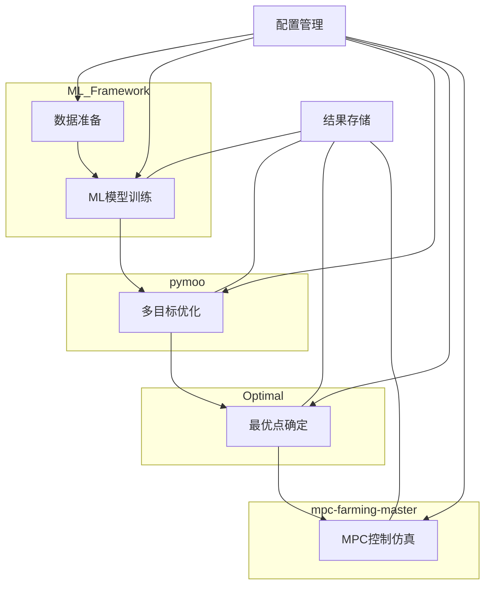

# 集成优化流程系统设计文档

## 概述

集成优化流程系统是一个端到端的温室环境优化平台，将机器学习模型训练、多目标优化、最优点确定和MPC控制仿真集成到一个统一的工作流程中。系统采用模块化设计，确保各组件之间的无缝集成和数据流转。

## 架构

### 系统架构图



### 技术栈

- **机器学习框架**: scikit-learn, PyTorch
- **优化库**: pymoo, NumPy, SciPy
- **数据处理**: pandas, NumPy
- **可视化**: matplotlib, seaborn
- **控制仿真**: 自定义MPC实现
- **工作流管理**: Python脚本编排

## 组件和接口

### 1. 集成工作流管理器 (IntegratedWorkflowManager)

**职责**: 协调整个流程的执行，管理组件间的数据传递

**核心类**:
```python
class IntegratedWorkflowManager:
    def __init__(self, config_path):
        self.config = self._load_config(config_path)
        self.ml_manager = MLModelManager(self.config["ml_config"])
        self.optimization_manager = OptimizationManager(self.config["optimization_config"])
        self.optimal_point_manager = OptimalPointManager(self.config["optimal_point_config"])
        self.mpc_manager = MPCSimulationManager(self.config["mpc_config"])
        
    def run_complete_workflow(self):
        """执行完整的工作流程"""
        # 1. 训练ML模型
        model_path = self.ml_manager.train_and_save_model()
        
        # 2. 运行多目标优化
        pareto_results_path = self.optimization_manager.run_optimization(model_path)
        
        # 3. 确定最优点
        optimal_params = self.optimal_point_manager.find_optimal_point(pareto_results_path)
        
        # 4. 运行MPC仿真
        simulation_results = self.mpc_manager.run_simulation(optimal_params)
        
        # 5. 生成综合报告
        self._generate_report(model_path, pareto_results_path, optimal_params, simulation_results)
        
    def run_from_checkpoint(self, checkpoint_stage, checkpoint_data):
        """从检查点恢复执行"""
        # 实现从特定阶段恢复执行的逻辑
```

### 2. ML模型管理器 (MLModelManager)

**职责**: 管理机器学习模型的训练、评估和存储

**核心类**:
```python
class MLModelManager:
    def __init__(self, config):
        self.config = config
        self.data_processor = DataProcessor(config["data_config"])
        
    def train_and_save_model(self):
        """训练并保存光合作用预测模型"""
        # 1. 加载和预处理数据
        X_train, X_test, y_train, y_test = self.data_processor.prepare_data()
        
        # 2. 训练模型
        model = self._train_model(X_train, y_train, self.config["model_type"])
        
        # 3. 评估模型
        metrics = self._evaluate_model(model, X_test, y_test)
        
        # 4. 保存模型和评估结果
        model_path = self._save_model(model, metrics)
        
        return model_path
        
    def _train_model(self, X_train, y_train, model_type):
        """根据指定类型训练模型"""
        # 实现不同类型模型的训练逻辑
        
    def _evaluate_model(self, model, X_test, y_test):
        """评估模型性能"""
        # 计算R²、RMSE等性能指标
        
    def _save_model(self, model, metrics):
        """保存模型和评估结果"""
        # 保存到指定路径并返回路径
```

### 3. 优化管理器 (OptimizationManager)

**职责**: 管理多目标优化过程，包括CLED成本函数生成和Pareto解集计算

**核心类**:
```python
class OptimizationManager:
    def __init__(self, config):
        self.config = config
        
    def run_optimization(self, model_path):
        """运行多目标优化"""
        # 1. 加载预测模型
        model = self._load_model(model_path)
        
        # 2. 创建CLED成本函数
        cost_function = self._create_cled_cost_function()
        
        # 3. 设置优化问题
        problem = self._setup_optimization_problem(model, cost_function)
        
        # 4. 运行NSGA-II算法
        results = self._run_nsga2(problem)
        
        # 5. 保存Pareto解集
        results_path = self._save_results(results)
        
        return results_path
        
    def _load_model(self, model_path):
        """加载预测模型"""
        # 实现模型加载逻辑
        
    def _create_cled_cost_function(self):
        """创建CLED成本函数"""
        # 实现成本函数生成逻辑
        
    def _setup_optimization_problem(self, model, cost_function):
        """设置多目标优化问题"""
        # 定义决策变量、目标函数和约束条件
        
    def _run_nsga2(self, problem):
        """运行NSGA-II算法"""
        # 执行多目标优化
        
    def _save_results(self, results):
        """保存优化结果"""
        # 保存Pareto解集和相关数据
```

### 4. 最优点管理器 (OptimalPointManager)

**职责**: 从Pareto解集中确定最优操作点，进行曲线拟合和分析

**核心类**:
```python
class OptimalPointManager:
    def __init__(self, config):
        self.config = config
        
    def find_optimal_point(self, pareto_results_path):
        """确定最优操作点"""
        # 1. 加载Pareto解集
        pareto_solutions = self._load_pareto_solutions(pareto_results_path)
        
        # 2. 拟合曲线
        fitted_curves = self._fit_curves(pareto_solutions)
        
        # 3. 确定最优点
        optimal_params = self._determine_optimal_point(fitted_curves)
        
        # 4. 生成可视化
        self._generate_visualizations(pareto_solutions, fitted_curves, optimal_params)
        
        # 5. 保存结果
        self._save_results(optimal_params, fitted_curves)
        
        return optimal_params
        
    def _load_pareto_solutions(self, path):
        """加载Pareto解集"""
        # 实现数据加载逻辑
        
    def _fit_curves(self, solutions):
        """拟合曲线"""
        # 实现曲线拟合算法
        
    def _determine_optimal_point(self, curves):
        """确定最优点"""
        # 实现最优点确定逻辑
        
    def _generate_visualizations(self, solutions, curves, optimal_point):
        """生成可视化图表"""
        # 创建图表展示结果
        
    def _save_results(self, optimal_params, fitted_curves):
        """保存结果"""
        # 保存最优参数和拟合曲线
```

### 5. MPC仿真管理器 (MPCSimulationManager)

**职责**: 使用最优参数配置和运行MPC控制仿真

**核心类**:
```python
class MPCSimulationManager:
    def __init__(self, config):
        self.config = config
        
    def run_simulation(self, optimal_params):
        """运行MPC控制仿真"""
        # 1. 配置MPC控制器
        controller = self._configure_controller(optimal_params)
        
        # 2. 设置仿真环境
        environment = self._setup_environment()
        
        # 3. 运行仿真
        simulation_results = self._run_simulation(controller, environment)
        
        # 4. 评估性能
        performance_metrics = self._evaluate_performance(simulation_results)
        
        # 5. 保存结果
        self._save_results(simulation_results, performance_metrics)
        
        return {
            "simulation_results": simulation_results,
            "performance_metrics": performance_metrics
        }
        
    def _configure_controller(self, params):
        """配置MPC控制器"""
        # 使用最优参数配置控制器
        
    def _setup_environment(self):
        """设置仿真环境"""
        # 创建温室环境模型
        
    def _run_simulation(self, controller, environment):
        """运行仿真"""
        # 执行控制仿真
        
    def _evaluate_performance(self, results):
        """评估性能"""
        # 计算性能指标
        
    def _save_results(self, results, metrics):
        """保存结果"""
        # 保存仿真结果和性能指标
```

## 数据流

### 1. 数据格式和传递

**ML模型输出格式**:
```python
{
    "model_path": "ML_Framework/results/model_name_timestamp/models/best_model.pkl",
    "scaler_path": "ML_Framework/results/model_name_timestamp/models/scaler.pkl",
    "metrics": {
        "r2_score": 0.95,
        "rmse": 0.12,
        "mae": 0.09
    },
    "model_type": "LSSVR",
    "hyperparameters": {
        "gamma": 0.5,
        "sigma2": 0.1
    }
}
```

**优化结果格式**:
```python
{
    "pareto_front_path": "pymoo/results/optimization_name_timestamp/pareto_front.csv",
    "visualization_path": "pymoo/results/optimization_name_timestamp/pareto_front.png",
    "summary": {
        "num_solutions": 50,
        "objectives": ["photosynthesis_rate", "cled_cost"],
        "algorithm": "NSGA-II",
        "generations": 100
    }
}
```

**最优点结果格式**:
```python
{
    "optimal_params": {
        "ppfd": 650,
        "r_b_ratio": 0.83,
        "temperature": 24.5
    },
    "performance": {
        "photosynthesis_rate": 12.5,
        "cled_cost": 0.45
    },
    "visualization_path": "Optimal/results/analysis_timestamp/optimal_point.png"
}
```

**仿真结果格式**:
```python
{
    "simulation_summary": {
        "duration": 24,  # 小时
        "time_step": 0.1,  # 小时
        "control_strategy": "MPC"
    },
    "performance_metrics": {
        "cumulative_photosynthesis": 250.5,
        "energy_consumption": 12.3,
        "control_stability": 0.95
    },
    "visualization_path": "mpc-farming-master/simulation_timestamp/performance.png"
}
```

### 2. 文件存储结构

```
project_root/
├── integrated_workflow/
│   ├── config/
│   │   └── workflow_config.yaml
│   ├── logs/
│   ├── results/
│   └── run_workflow.py
├── ML_Framework/
│   ├── results/
│   │   └── model_name_timestamp/
│   │       ├── models/
│   │       ├── plots/
│   │       └── results.json
│   └── run_experiment.py
├── pymoo/
│   ├── results/
│   │   └── optimization_name_timestamp/
│   │       ├── pareto_front.csv
│   │       ├── pareto_front.png
│   │       └── summary.json
│   └── find_optimal_conditions_multi_model.py
├── Optimal/
│   ├── results/
│   │   └── analysis_timestamp/
│   │       ├── optimal_point.png
│   │       └── analysis_results.json
│   └── fit.py
└── mpc-farming-master/
    ├── simulation_timestamp/
    │   ├── performance.png
    │   └── simulation_results.json
    └── mpc.py
```

## 错误处理

### 错误分类和处理策略

1. **数据错误**
   - 数据缺失或格式不正确
   - 处理策略：数据验证、提供明确错误信息、可能时使用默认值

2. **模型错误**
   - 模型训练失败或性能不佳
   - 处理策略：回退到备用模型、记录详细错误信息、提供调优建议

3. **优化错误**
   - 算法不收敛或解集质量差
   - 处理策略：调整参数重试、使用替代算法、限制迭代次数

4. **集成错误**
   - 组件间数据传递失败
   - 处理策略：检查点保存、从最近检查点恢复、提供诊断信息

### 错误日志格式
```json
{
  "timestamp": "2024-07-17T14:30:00Z",
  "level": "ERROR",
  "component": "OptimizationManager",
  "message": "优化算法未能收敛",
  "details": {
    "algorithm": "NSGA-II",
    "generations_completed": 45,
    "error_type": "ConvergenceError",
    "parameters": {
      "population_size": 100,
      "crossover_rate": 0.8
    }
  },
  "recovery_action": "Retrying with increased population size"
}
```

## 测试策略

### 单元测试
- 各组件核心功能测试
- 数据处理和转换测试
- 错误处理机制测试

### 集成测试
- 组件间数据传递测试
- 完整工作流执行测试
- 检查点恢复功能测试

### 性能测试
- 大规模数据处理能力测试
- 优化算法性能测试
- 端到端执行时间测试

### 测试数据
- 标准测试数据集
- 边界条件测试用例
- 错误情况模拟数据

## 配置管理

### 配置文件结构
```yaml
# workflow_config.yaml
general:
  output_dir: "./integrated_results"
  log_level: "INFO"
  enable_checkpoints: true
  checkpoint_frequency: 1  # 每个阶段结束后

ml_config:
  data_path: "ML_Framework/Data/averaged_data.csv"
  model_type: "LSSVR"  # 可选: LSSVR, GPR, SVR
  test_size: 0.2
  random_state: 42
  hyperparameters:
    LSSVR:
      gamma: 0.5
      sigma2: 0.1
    GPR:
      alpha: 1e-10
      kernel: "RBF"

optimization_config:
  algorithm: "NSGA-II"  # 可选: NSGA-II, SPEA2
  population_size: 100
  generations: 200
  variables:
    ppfd:
      lower_bound: 100
      upper_bound: 1000
    r_b_ratio:
      lower_bound: 0.5
      upper_bound: 4.0
    temperature:
      lower_bound: 15
      upper_bound: 35
  objectives:
    - maximize_photosynthesis
    - minimize_cled_cost

optimal_point_config:
  fitting_method: "polynomial"  # 可选: polynomial, spline
  polynomial_degree: 3
  visualization:
    enable: true
    format: "png"
    dpi: 300

mpc_config:
  simulation_duration: 24  # 小时
  time_step: 0.1  # 小时
  control_horizon: 6  # 步数
  prediction_horizon: 12  # 步数
  constraints:
    ppfd:
      min: 0
      max: 1000
    temperature:
      min: 15
      max: 35
```

## 用户界面

本系统主要通过命令行界面(CLI)操作，提供以下主要命令：

1. **运行完整工作流**
   ```bash
   python integrated_workflow/run_workflow.py --config config/workflow_config.yaml
   ```

2. **从检查点恢复**
   ```bash
   python integrated_workflow/run_workflow.py --config config/workflow_config.yaml --resume --checkpoint checkpoint_file.pkl
   ```

3. **运行单个阶段**
   ```bash
   python integrated_workflow/run_workflow.py --config config/workflow_config.yaml --stage [ml|optimization|optimal_point|simulation]
   ```

4. **生成报告**
   ```bash
   python integrated_workflow/generate_report.py --results integrated_results/latest
   ```

## 扩展性考虑

1. **支持新模型类型**
   - 通过模型接口抽象支持添加新的机器学习模型
   - 配置文件中可定义新模型类型和参数

2. **支持新优化算法**
   - 优化管理器设计为可插拔不同算法
   - 通过配置文件指定算法类型和参数

3. **支持新的控制策略**
   - MPC仿真管理器可扩展支持不同控制策略
   - 提供控制器接口以实现新的控制算法

4. **数据源扩展**
   - 数据处理组件设计为支持多种数据源
   - 可添加新的数据连接器以支持不同数据格式