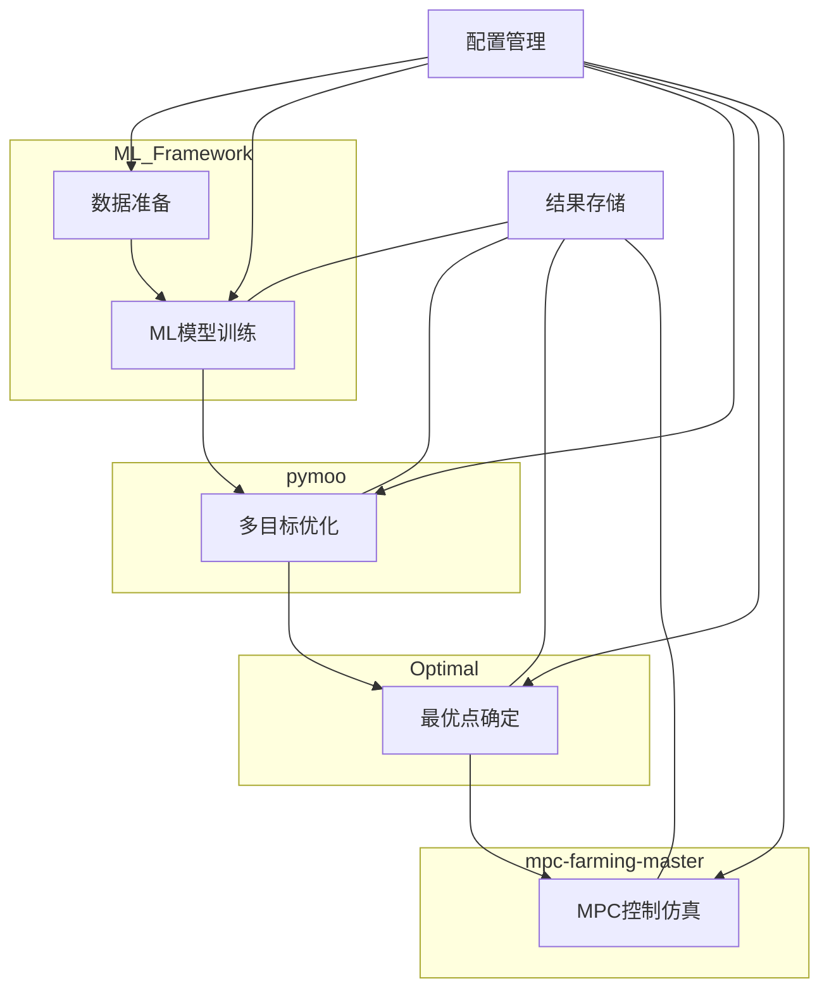

# 集成优化流程系统

这个系统整合了ML模型训练、多目标优化、最优点确定和MPC仿真的完整工作流程，为温室环境控制提供端到端的优化解决方案。

## 系统概述

集成优化流程系统是一个端到端的温室环境优化平台，将机器学习模型训练、多目标优化、最优点确定和MPC控制仿真集成到一个统一的工作流程中。系统采用模块化设计，确保各组件之间的无缝集成和数据流转。

工作流程按以下顺序执行：

1. **ML模型训练** - 使用ML_Framework训练光合作用预测模型
2. **多目标优化** - 使用pymoo进行CLED成本和光合效率的多目标优化
3. **最优点确定** - 使用Optimal模块从Pareto解集中确定最优PPFD和R:B参数
4. **MPC仿真** - 使用mpc-farming-master验证最优参数的控制效果

## 系统架构



## 目录结构

```
integrated_workflow/
├── config/
│   └── workflow_config.yaml    # 主配置文件
├── logs/                       # 日志目录
├── results/                    # 结果输出目录
│   └── workflow_YYYYMMDD_HHMMSS/  # 每次运行的结果目录
│       ├── config.yaml         # 配置副本
│       ├── workflow.log        # 执行日志
│       ├── workflow_report.json # 执行报告
│       ├── checkpoints/        # 检查点文件
│       ├── ml_training/        # ML训练结果
│       ├── optimization/       # 优化结果
│       ├── optimal_point/      # 最优点确定结果
│       └── mpc_simulation/     # MPC仿真结果
├── utils/
│   ├── __init__.py
│   ├── logging_utils.py        # 日志工具
│   └── config_utils.py         # 配置工具
├── workflow_manager/
│   ├── __init__.py
│   └── integrated_workflow_manager.py  # 工作流管理器
├── run_workflow.py             # 主程序入口
├── test_workflow.py            # 测试脚本
└── README.md                   # 本文件
```

## 安装和配置

### 前置条件

确保以下目录和脚本存在：
- `ML_Framework/run_experiment.py` - ML模型训练脚本
- `pymoo/find_optimal_conditions_multi_model.py` - 多目标优化脚本
- `Optimal/fit.py` - 最优点确定脚本
- `mpc-farming-master/mpc.py` - MPC仿真脚本

### 依赖项

系统依赖以下Python库：
- PyYAML: 用于配置文件处理
- NumPy: 用于数学计算
- Pandas: 用于数据处理
- Matplotlib: 用于可视化
- SciPy: 用于科学计算

可以使用以下命令安装依赖：
```bash
pip install pyyaml numpy pandas matplotlib scipy
```

### 配置文件

编辑 `integrated_workflow/config/workflow_config.yaml` 来配置各个阶段的参数，或者使用以下命令生成默认配置：

```bash
python integrated_workflow/run_workflow.py --generate-config my_config.yaml
```

配置文件结构如下：

```yaml
general:
  output_dir: "integrated_workflow/results"
  log_level: "INFO"
  enable_checkpoints: true
  checkpoint_frequency: 1  # 每个阶段结束后

ml_training:
  framework_path: "ML_Framework"
  script_path: "run_experiment.py"
  config_file: "config/gpr_cmaes_config.yaml"
  model_type: "LSSVR"  # 可选: LSSVR, GPR, SVR
  test_size: 0.2
  random_state: 42

optimization:
  framework_path: "pymoo"
  script_path: "find_optimal_conditions_multi_model.py"
  algorithm: "NSGA2"  # 可选: NSGA2, SPEA2
  population_size: 100
  generations: 200
  variables:
    ppfd:
      lower_bound: 100
      upper_bound: 1000
    r_b_ratio:
      lower_bound: 0.5
      upper_bound: 4.0
    temperature:
      lower_bound: 15
      upper_bound: 35
  objectives:
    - maximize_photosynthesis
    - minimize_cled_cost

optimal_point:
  framework_path: "Optimal"
  script_path: "fit.py"
  fitting_method: "polynomial"  # 可选: polynomial, spline
  polynomial_degree: 3
  visualization:
    enable: true
    format: "png"
    dpi: 300

mpc_simulation:
  framework_path: "mpc-farming-master"
  script_path: "mpc.py"
  simulation_duration: 24  # 小时
  time_step: 0.1  # 小时
  control_horizon: 6  # 步数
  prediction_horizon: 12  # 步数
  constraints:
    ppfd:
      min: 0
      max: 1000
    temperature:
      min: 15
      max: 35
```

### 验证配置

在执行工作流之前，可以验证配置文件是否正确：

```bash
python integrated_workflow/run_workflow.py --dry-run
```

## 使用方法

### 1. 运行完整工作流

```bash
python integrated_workflow/run_workflow.py
```

### 2. 运行特定阶段

```bash
# 只运行ML训练
python integrated_workflow/run_workflow.py --stage ml

# 只运行优化
python integrated_workflow/run_workflow.py --stage optimization

# 只运行最优点确定
python integrated_workflow/run_workflow.py --stage optimal_point

# 只运行MPC仿真
python integrated_workflow/run_workflow.py --stage simulation
```

### 3. 从检查点恢复

```bash
python integrated_workflow/run_workflow.py --resume --checkpoint path/to/checkpoint.pkl
```

### 4. 验证配置

```bash
python integrated_workflow/run_workflow.py --dry-run
```

### 5. 设置日志级别

```bash
python integrated_workflow/run_workflow.py --log-level DEBUG
```

## 命令行参数

- `--config`: 配置文件路径 (默认: integrated_workflow/config/workflow_config.yaml)
- `--stage`: 执行阶段 (ml|optimization|optimal_point|simulation|all, 默认: all)
- `--resume`: 从检查点恢复执行
- `--checkpoint`: 检查点文件路径
- `--log-level`: 日志级别 (DEBUG|INFO|WARNING|ERROR, 默认: INFO)
- `--dry-run`: 仅验证配置，不执行工作流

## 输出结果

每次运行会在 `integrated_workflow/results/` 下创建一个时间戳命名的目录，包含：

```
workflow_YYYYMMDD_HHMMSS/
├── config.yaml                 # 使用的配置副本
├── workflow.log                # 执行日志
├── workflow_report.json        # 执行报告
├── checkpoints/                # 检查点文件
├── ml_training/                # ML训练结果
├── optimization/               # 优化结果
├── optimal_point/              # 最优点确定结果
└── mpc_simulation/             # MPC仿真结果
```

## 测试

运行测试脚本来验证系统组件：

```bash
python integrated_workflow/test_workflow.py
```

## 错误处理

系统包含完善的错误处理机制：

1. **配置验证** - 启动前验证所有配置和依赖
2. **检查点机制** - 每个阶段完成后自动保存检查点
3. **详细日志** - 记录所有执行过程和错误信息
4. **优雅失败** - 出错时提供清晰的错误信息和恢复建议

## 故障排除

### 常见问题

1. **配置文件不存在**
   - 确保 `integrated_workflow/config/workflow_config.yaml` 存在
   - 检查配置文件格式是否正确

2. **外部脚本不存在**
   - 确保所有依赖的脚本文件存在
   - 检查配置文件中的路径是否正确

3. **权限问题**
   - 确保有写入结果目录的权限
   - 检查外部脚本是否可执行

4. **内存不足**
   - 减少优化算法的种群大小和迭代次数
   - 监控系统资源使用情况

### 日志分析

查看详细的执行日志：
```bash
tail -f integrated_workflow/results/workflow_YYYYMMDD_HHMMSS/workflow.log
```

### 检查点恢复

如果执行中断，可以从最近的检查点恢复：
```bash
python integrated_workflow/run_workflow.py --resume --checkpoint integrated_workflow/results/workflow_YYYYMMDD_HHMMSS/checkpoints/checkpoint_stage_name_timestamp.pkl
```

## 扩展和定制

系统设计为模块化和可扩展的：

1. **添加新阶段** - 在工作流管理器中添加新的执行方法
2. **修改配置** - 通过配置文件调整各阶段参数
3. **自定义日志** - 修改日志格式和输出级别
4. **集成新工具** - 通过标准接口集成新的优化或仿真工具

## 性能优化

1. **并行执行** - 某些阶段可以并行执行以提高效率
2. **资源管理** - 监控和限制内存和CPU使用
3. **缓存机制** - 缓存中间结果以避免重复计算
4. **增量更新** - 支持增量更新和部分重新执行

## 支持和维护

- 查看日志文件获取详细的执行信息
- 使用测试脚本验证系统组件
- 定期备份重要的结果和配置文件
- 监控系统资源使用情况